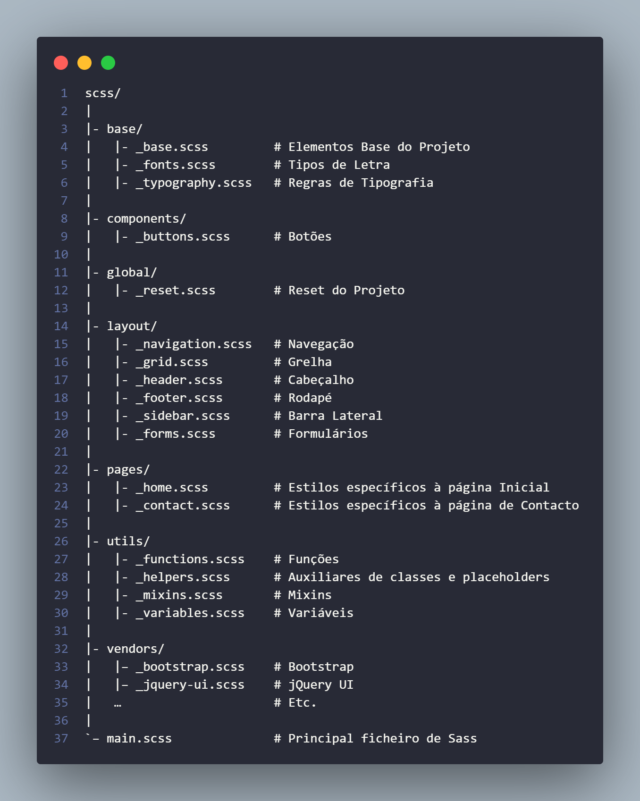

# Arquitetura Sass - 7-1 - 
## rodrusantu




## Execução do arquivo - via Terminal VSCode com o Sass já instalado no projeto.
Transformando o arquivo **.scss** em **.css** para uso no HTML

```
sass main.scss style.css
```